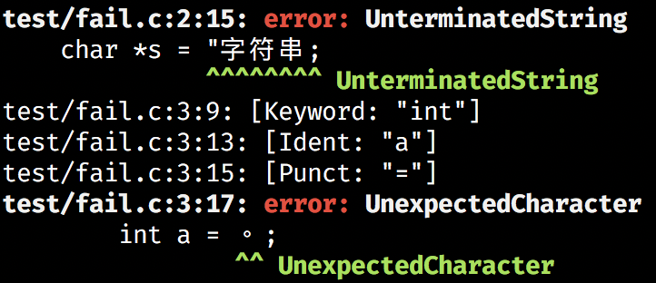
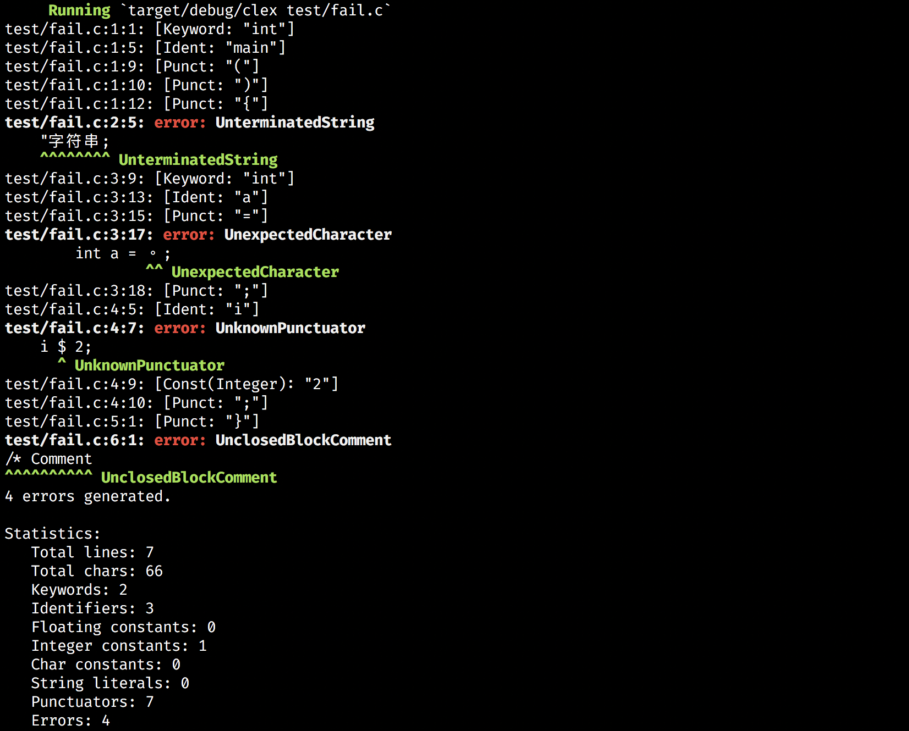

# C 语言词法分析器

## 实验内容

设计并实现 C 语言的词法分析程序，要求实现如下功能：

- 可以识别出用 C 语言编写的源程序中的每个单词符号，并按照记号的形式输出每个单词符号。
- 跳过源程序中的注释。
- 统计源程序的行数，各类单词的个数，字符总数，并输出统计结果。
- 检查程序中存在的词法错误，并报告错误的所在位置。
- 通过对错误进行恢复，实现只需一次扫描即可报告程序中存在的全部语法错误。

## 实验环境

本次实验选择使用 Rust 语言来编写该词法分析程序。

### 为什么要使用 Rust 语言

- 性能。Rust 没有垃圾回收，且与 Clang 同样采用 LLVM 作为编译器后端，是唯一一个与 C/C++ 性能相当的现代编程语言；
- 更加优雅的字符串处理。众所周知 C++ 中的字符串 `std::string` 处理字符编码问题的臭名昭著：其只能算作一个字节数组，根本没有处理 UTF-8 这种变长多字节编码的能力。而 Rust 从语言级别支持 UTF-8 编码，把字节（bytes）流与字符（chars）流很好地区分了开来。这就让我们的词法分析程序可以很好地支持中文等 Unicode 字符。
- 抽象。与 C++ 中的 `enum` 相比，Rust 中的 `enum` 是完善的 Sum Type，同时具备了 C++ 中 `enum` 与 `union` 的功能，非常适合词法分析中储存不同类型 Token 的场景。

## 程序设计与实现

本词法分析程序主要根据 ISO/IEC 9899:TC3 标准草案实现 C99 的词法分析。相对于源草案，本词法分析程序做了一些简化：

- 不对预处理指令进行处理。事实上，预处理过程并不是词法分析程序的职责；
- 不识别 C99 中新加入的十六进制浮点数，因其语法实在奇怪，且过于生僻；
- 处理 Identifier 时，不处理 Universal Character Name。

同时，本词法分析程序还实现了：

- 对于一些常见的词法错误，我们把错误文法也编入了词法分析程序中，并返回一个类型为 `Error` 的 Token。这样做可以优雅地实现错误的处理与恢复。

### 模块划分

#### `source::SourceFile`

提供对源代码文件进行预处理的功能，支持根据字符的位置定位行、列等。

定义如下：

```rust
#[derive(Clone)]
pub struct SourceFile {
    /// 源文件路径
    pub path: PathBuf,
    /// 以字符串存储的源代码内容
    pub src: Rc<String>,
    /// 所有换行符的位置
    pub lines: Rc<Vec<usize>>,
}
```

其实现有如下函数：

- `pub fn open(path: PathBuf) -> Result<Self>`：根据文件路径打开源文件；
- `pub fn analyze_lines(src: &str) -> Vec<usize>`：扫描源文件，找到所有换行符的位置；
- `pub fn lookup_line_column(&self, char_pos: usize) -> (usize, usize)`：给定字符偏移，二分查找获得该偏移对应源文件的行、列。
- `pub fn display_error_hint(&self, token: &Token) -> Result<()>`：实现优美的错误输出。

优美的错误信息如下图：



#### `token::Token`

定义如下：

```rust
#[derive(Clone, PartialEq, Eq)]
pub struct Token<'a> {
    pub kind: TokenKind,
    pub byte_range: Range<usize>,
    pub char_range: Range<usize>,
    pub src: &'a str,
}
```

这里注意到，Token 并不真正存储其自身的内容，而是持有一份对源代码的引用，以及自己对应到源代码的字符范围。这样的设计使得 Token 结构体的创建与销毁可以完全在栈上进行，不会涉及到堆内存的分配，使得我们的词法分析程序十分高效。

#### `token::TokenKind`

表示 Token 的类别。其定义如下：

```rust
#[derive(Clone, Copy, Debug, PartialEq, Eq, PartialOrd, Ord)]
pub enum TokenKind {
    /* tokens */
    Keyword,
    Ident,
    Const(ConstKind),
    StrLit,
    Punct,
    /* compiler internal tokens */
    Comment,
    Whitespace,
    Error(ErrorKind),
}
```

在这里，词法分析器内部把空白、注释以及错误统一视作不同类型的 Token，输出时再进一步加以区分和过滤。这样可以降低词法分析器编写的难度，同时提供更加完善的错误处理功能以及友好的报错信息。

#### `token::ErrorKind`

我们的词法分析程序可以检测并处理如下几种错误：

```rust
#[derive(Clone, Copy, Debug, PartialEq, Eq, PartialOrd, Ord)]
pub enum ErrorKind {
    UnclosedBlockComment,
    UnterminatedString,
    UnterminatedChar,
    UnknownPunctuator,
    UnexpectedCharacter,
    InvalidIntegerSuffix,
    InvalidFloatingSuffix,
    NoHexadecimalDigits,
    #[allow(unused)]
    Unknown,
}
```

#### `lexer::Lexer`

词法分析程序主体。其定义如下：

```rust
pub struct Lexer<'a> {
    src: &'a str,
    byte_cursor: usize,
    char_cursor: usize,
}
```

内部同样持有一份对源代码内容的引用，以及词法分析程序当前指向的字符光标。

`advance_token` 函数是 `Lexer` 的主体函数。调用这个函数会使词法分析程序向前推进一个 Token，并返回这个 Token。这个函数的大致定义如下：

```rust
    pub fn advance_token(&mut self) -> Option<Token<'a>> {
        let initial_byte_cursor = self.byte_cursor;
        let initial_char_cursor = self.char_cursor;

        let first_char = self.bump_char()?;

        let token_kind = match first_char {
            /* 为了清晰起见，与源程序相比，这里省略了一些选择分支 */
            c if c.is_whitespace() => self.whitespace(),
            '/' if self.peek_char(0) == '/' => self.line_comment(),
            '/' if self.peek_char(0) == '*' => self.block_comment(),
            '"' => self.string_literal(),
            '\'' => self.char_const(),
            '_' | 'a'..='z' | 'A'..='Z' => self.ident_or_keyword(initial_byte_cursor),
            digit if digit.is_ascii_digit() => self.number(digit),
            symbol if symbol.is_ascii_punctuation() => self.punct(symbol),
            _ => Error(UnexpectedCharacter),
        };

        Some(Token::new(
            token_kind,
            initial_byte_cursor..self.byte_cursor,
            initial_char_cursor..self.char_cursor,
            self.src,
        ))
    }
```

可以看到，该函数根据首字符的不同调用不同的子函数进行词法分析，子函数返回分析得到的 Token 类型。不停调用 `advance_token`，就可以分析完整个源代码。

#### `stats::Statistics`

提供统计功能，统计源程序的行数，各类单词的个数，字符总数，并可以输出统计结果。

定义如下：

```rust
#[derive(Debug, Default)]
pub struct Statistics {
    pub lines: usize,
    pub len: usize,
    pub keywords: usize,
    pub idents: usize,
    pub floats: usize,
    pub ints: usize,
    pub chars: usize,
    pub strs: usize,
    pub puncts: usize,
    pub errors: usize,
}
```

## 测试

本词法分析程序的命令行说明如下：

```bash
A C99-compatible lexer written in Rust

USAGE:
    clex <source>

FLAGS:
    -h, --help       Prints help information
    -V, --version    Prints version information

ARGS:
    <source>    The source code file
```

首先测试测试正确的源程序：

```c
// Line comment
int main() {
    /*
     * Block comment
     */
    char *msg = "你好";
    float d = .114e+10f;
    return 0;
}
```

输出如下：

```bash
test/hello.c:2:1: [Keyword: "int"]
test/hello.c:2:5: [Ident: "main"]
test/hello.c:2:9: [Punct: "("]
test/hello.c:2:10: [Punct: ")"]
test/hello.c:2:12: [Punct: "{"]
test/hello.c:6:5: [Keyword: "char"]
test/hello.c:6:10: [Punct: "*"]
test/hello.c:6:11: [Ident: "msg"]
test/hello.c:6:15: [Punct: "="]
test/hello.c:6:17: [StrLit: "\"你好\""]
test/hello.c:6:21: [Punct: ";"]
test/hello.c:7:5: [Keyword: "float"]
test/hello.c:7:11: [Ident: "d"]
test/hello.c:7:13: [Punct: "="]
test/hello.c:7:15: [Const(Float): ".114e+10f"]
test/hello.c:7:24: [Punct: ";"]
test/hello.c:8:5: [Keyword: "return"]
test/hello.c:8:12: [Const(Integer): "0"]
test/hello.c:8:13: [Punct: ";"]
test/hello.c:9:1: [Punct: "}"]
0 error generated.

Statistics:
   Total lines: 10
   Total chars: 128
   Keywords: 4
   Identifiers: 3
   Floating constants: 1
   Integer constants: 1
   Char constants: 0
   String literals: 1
   Punctuators: 10
   Errors: 0
```

然后，测试一例错误程序：

```c
int main() {
    "字符串;
        int a = 。;
    i $ 2;
}
/* Comment
```

输出如下：



## 如何编译本词法分析程序

### 安装 Rust

Rust 官网有着详细的步骤提示。

在 Linux 或 macOS 上，输入以下命令即可安装 Rust：

```bash
curl --proto '=https' --tlsv1.2 -sSf https://sh.rustup.rs | sh
```

### 编译运行

运行以下命令即可：

```bash
cd clex && cargo run test/test.c
```
